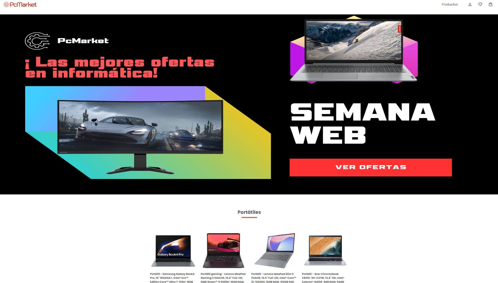
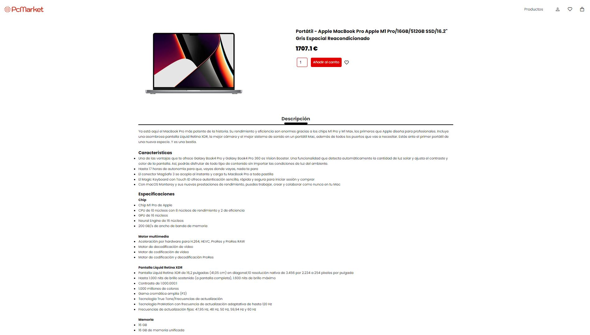
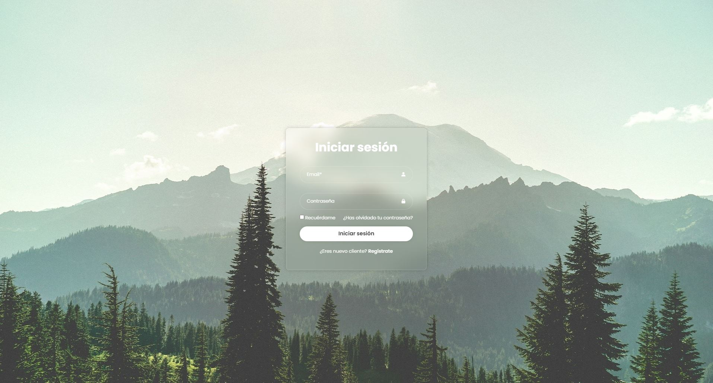
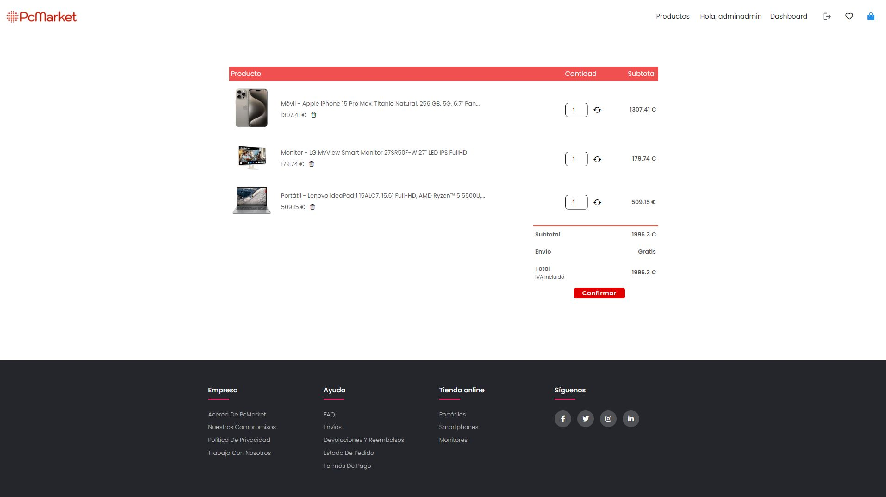
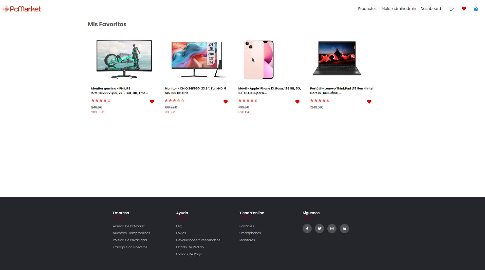
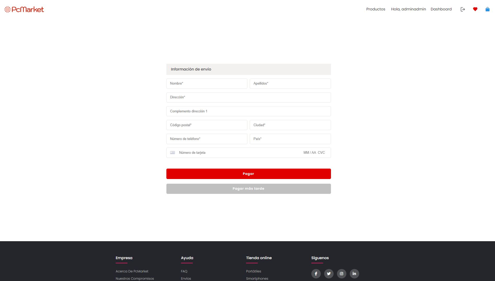
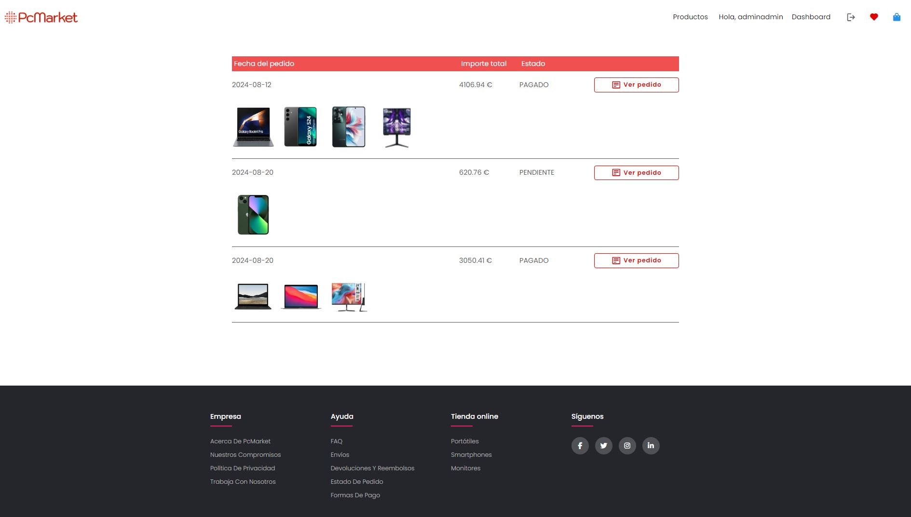
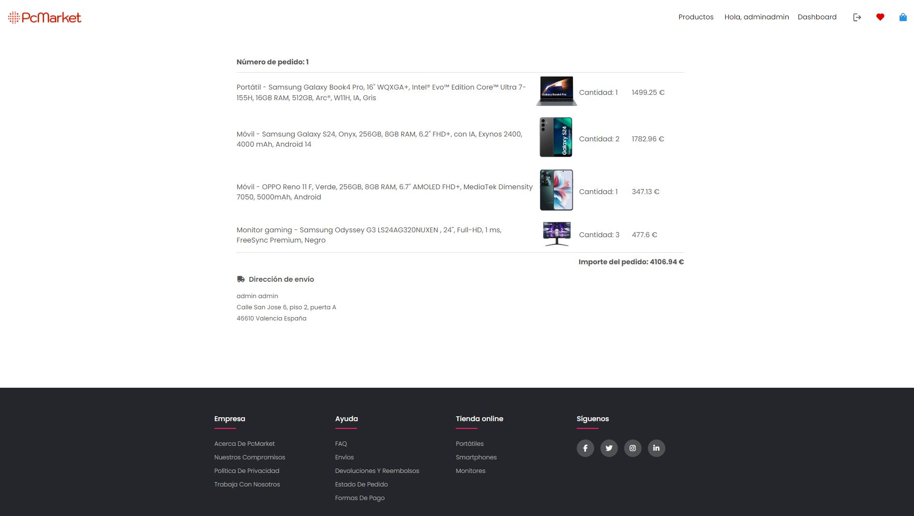
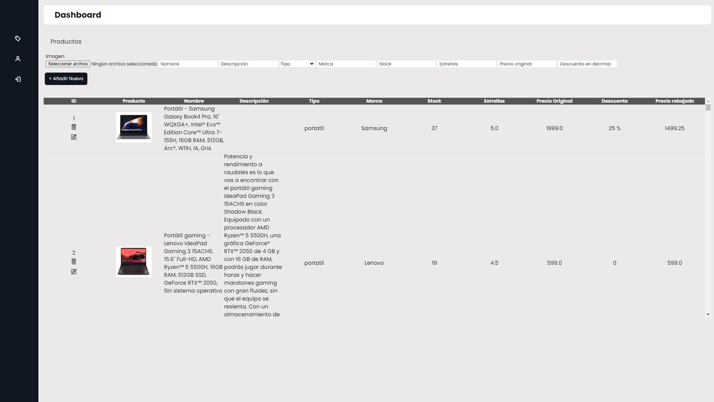

# PCMARKET_SERVICE
An ecommerce store of PC hardware, consumer electronics, home appliances and lifestyle technology.

## Description
PC Market is an online shop which offers a wide range of computer hardware and PC components. In order to finalize a purchase, users would need to log in with a registered account. Clients can edit their personal data and visualize the order history in their profile, while the web administrator has access to the dashboard page for product management.

## Ecommerce Website Preview



















## Technology stack used
##### Front-End Development Languages:
- HTML5
- CSS3
- Javascript

##### Front-End Development Skills:
- Jinja
- Boxicons
- Google Fonts

##### Back-End Development Languages:
- Python 3.12
- FastAPI
- Pydantic
- MySQL

## Installation 
To run this project, first you need to install the dependencies with pipenv. Just run ```pipenv install```. And then you may need to copy and paste the environment variables written in the documentation (there are some small differences between running the application with your MySQL previously installed or with a Docker container). To start the application, run ```pipenv run start```.
